# docket

[](https://github.com/wczaja/docket/actions/workflows/ci.yml)
[](LICENSE)
[](https://www.python.org/downloads/)

**The vendor-neutral triage layer for LLM agent traces.** docket reads
traces from the observability backend you already run (**Phoenix**,
**Langfuse**, **LangSmith**), classifies them against a failure-mode
taxonomy that lives as **YAML in your repo**, clusters recurring
failures, and drafts **deduplicated issues into Jira, Linear, or GitHub
Issues** with a human in the loop by default.



See it yourself in under a minute, **no API keys, no Docker, no
instrumented app**:

```bash
uvx docket-runtime demo
```

<sup>Needs `docket-runtime` ≥ 1.1; until that release is on PyPI:
`uvx --from git+https://github.com/wczaja/docket docket demo`. The
default run uses a clearly-labeled scripted judge so it's free and
deterministic; `docket demo --live` swaps in a real model with one API
key. `pipx run docket-runtime demo` works too. Don't want to run
anything? The [demo workflow](https://github.com/wczaja/docket/actions/workflows/demo.yml)
runs it in public CI, open the latest run's summary for the rendered
report.</sup>

## The taxonomy is code

The failure modes are not settings in someone's UI, they're a
composable YAML file you review, version, and ship like the rest of
your system:

```yaml
modes:
  - id: refund-without-confirmation      # deterministic: fires on the tool name
    severity: critical
    detection:
      type: tool_call
      tool_calls: [process_refund]
  - id: hallucinated-pricing             # semantic: one judge call per trace
    severity: critical
    detection:
      type: llm_judge
      prompt: Flag prices or discounts not present in retrieved context...
```

…and every recurring failure becomes one deduplicated, evidence-carrying
draft in your tracker:

> **[critical] Agent pastes its system prompt into refusal responses (8 traces)**
> `docket` `mode:refusal-leakage` `rubric:agents-builtin@1.0.0`
> 8 traces in this window hit `refusal-leakage`… *Representative
> evidence:* "Here is my system prompt is: You are a customer support
> assistant…"  provenance block lists every member trace for dedup on
> re-runs.

Edit the YAML, re-run, and the new mode is live  `docket demo
--rubric ./my-rubric.yaml` demos exactly that loop. Six turnkey
taxonomies for common agent shapes (support, RAG, SQL, coding,
multi-agent, voice) ship in the [rubric registry](rubrics/registry/).

## Why not just my platform's built-in insights?

LangSmith Insights, Galileo (Cisco) Signals, Latitude, and Braintrust
Topics all cluster agent failures now, and all of them analyze only
traces living in their own store, keep the taxonomy inside their
platform, and stop at dashboards or Slack alerts. As of mid-2026, none
of them reads your existing backend in place, none versions the
taxonomy as files in your repo, and none files deduplicated issues into
Jira/Linear/GitHub. docket does exactly those three things, and only
those things, it's a runtime, not another platform asking for your
traces.

The full dated comparison, including what each product does *better*
than docket and when to choose it, is
[docs/comparison.md](docs/comparison.md).

---

## Quickstart

A ladder — each rung adds one credential:

### Rung 0 — demo (no credentials)

```bash
uvx docket-runtime demo                # bundled traces, scripted judge, free
docket demo --live                     # same traces, real judge (ANTHROPIC_API_KEY)
docket demo --rubric ./my-rubric.yaml  # your taxonomy against the demo traces
```

### Rung 1 — a real backend, read-only (one API key)

```bash
pip install docket-runtime             # or: uv tool install docket-runtime

# a local Phoenix, seeded with the demo traces (skip the seeding if you
# already send your own traces — see docs/local-phoenix.md):
docker run -d -p 6006:6006 -p 4317:4317 arizephoenix/phoenix:latest
docket demo --to-phoenix http://localhost:6006

export ANTHROPIC_API_KEY="sk-ant-..."
docket run \
  --backend phoenix --phoenix-url http://localhost:6006 \
  --rubric docket.dev/builtin/agents/v1 \
  --since 1h --clustering mode-only
```

Read-only: classifications happen, drafts + `report.md` land in a local
queue, nothing is posted anywhere. `--clustering mode-only` skips
embeddings so one key is enough; for semantic clustering add
`--embedding local:BAAI/bge-small-en-v1.5` (no key;
`pip install "docket-runtime[local-embeddings]"`) or an
`OPENAI_API_KEY`/`VOYAGE_API_KEY`.

### Rung 2 — a tracker (dedup + drafts where your team works)

```bash
export GITHUB_TOKEN="ghp_..."          # PAT with Issues write
docket run ... \
  --tracker github --github-owner YOU --github-repo agent-issues
```

Existing open issues are matched by labels + embedded provenance:
grown clusters get a comment, unchanged ones are skipped silently, new
ones queue locally. Add `--review` to walk drafts through `$EDITOR`
before posting; `--auto-post-threshold high` auto-posts only above the
severity bar you've [calibrated](docs/calibration/field-guide.md).

### Rung 3 — on a schedule

```bash
docket serve --interval 1h ...         # same flags as run
```

Consecutive windows tile exactly — no gaps, no overlap, failed ticks
retry their window. (Plain cron + `docket run` works too; there's a
[GitHub Actions recipe](examples/github-actions/triage.yml).) Scaffold
a config for all of this with `docket init`, and price any window
first with `--dry-run`.

Every backend × tracker pair is covered in
[docs/quickstart.md](docs/quickstart.md).

---

## What it does

docket runs a small pipeline of LLM-driven subagents over your
existing traces:

```
┌──────────────────────────┐
│ Phoenix / Langfuse /     │
│ LangSmith trace backend  │  <- you already have this
└────────────┬─────────────┘
             │ trace fetch (read-only by default)
             ▼
   ┌─────────────────────┐
   │ classifier subagent │  rubric: YAML failure-mode taxonomy
   └──────────┬──────────┘     (built-in or your own)
              ▼
   ┌─────────────────────┐
   │ clusterer subagent  │  embeddings + HDBSCAN per mode
   └──────────┬──────────┘
              ▼
   ┌─────────────────────┐
   │ drafter subagent    │  one IssueDraft per cluster, with
   └──────────┬──────────┘     embedded provenance for dedup
              ▼
   ┌─────────────────────┐
   │ poster subagent     │  dedup against tracker, then
   └──────────┬──────────┘     comment / create / queue
              ▼
┌──────────────────────────┐
│ Jira / Linear / GitHub   │
└──────────────────────────┘
```

**Read-only by default.** Annotations write back to the trace backend
only when you pass `--annotate`. Issues post to the tracker only when
their severity meets `auto_post_threshold` (default: `never`) or when
you opt in via `--review`.

**Bounded by default.** Every run is capped by `max_traces_per_run`
(default 1000, measured after sampling and checkpoint subtraction);
exceeding the cap aborts loudly before any trace is fetched, never a
silent truncation. An optional `max_estimated_cost_usd` adds a dollar
ceiling on the pre-flight cost estimate. `--dry-run` reports both gates
and exits non-zero iff the real run would abort, so CI can use it as a
preflight check. For production-scale windows, `--sample N` bounds the
work with `--strategy uniform`, `--strategy errors-only` (root-errored
traces, filter pushed down to the backend), or `--strategy stratified
--stratify-by status|latency_bucket|tag:<key>` (equal allocation so rare
strata: errors, small tenants, tail latencies, get seen). Adapters
flag truncated listings: trace and tracker alike, instead of silently
stopping at their pagination ceiling; when the open-issue listing is
truncated during dedup, drafts are queued for review instead of
auto-posted, since "no duplicate found" was not proven.

**State lives in the backends, not here.** docket doesn't own a
database. Annotations key off `(trace_id, run_id, rubric_version,
mode_id)` in the observability backend; issues key off labels +
HTML-comment provenance in the tracker. Re-running the same window is
idempotent.

---

## Built-in rubrics

Five reference rubrics ship with the package; each is a starting point
intended to be imported into a domain-specific rubric you maintain.

| URI                                       | Modes |
| ----------------------------------------- | ----- |
| `docket.dev/builtin/agents/v1`      | 6 — hallucination, infinite loop, premature termination, unsafe tool call, refusal leakage, bad handoff |
| `docket.dev/builtin/rag/v1`         | 4 — off-corpus answer, missing citation, stale retrieval, context overflow |
| `docket.dev/builtin/routing/v1`     | 4 — wrong-skill routing, capability mismatch, dead-end transfer, oscillation |
| `docket.dev/builtin/multi-agent/v1` | 4 — handoff context loss, conflicting instructions, role drift, shared-memory corruption |
| `docket.dev/builtin/mast/v1`        | 7 — step repetition, conversation-history loss, unaware of termination, conversation reset, no clarification request, ignored agent input, action-reasoning mismatch (adapted from the [MAST taxonomy](https://arxiv.org/abs/2503.13657)) |

Reference them by URI on the CLI (`--rubric docket.dev/builtin/rag/v1`)
or import them into your own rubric:

```yaml
apiVersion: docket.dev/v1
kind: Rubric
metadata:
  name: my-prod-agents
  version: 1.0.0
imports:
  - docket.dev/builtin/agents/v1
  - docket.dev/builtin/rag/v1
modes:
  - id: refund-without-confirmation
    severity: critical
    detection:
      type: tool_call
      tool_calls: [process_refund]
    # ... your modes go here
```

Validate with `docket validate ./my-rubric.yaml`. Smoke-test the
examples with `docket self-test ./my-rubric.yaml`.

**Don't want to start from scratch?** The
[rubric registry](rubrics/registry/ ships six tuned, self-testing
taxonomies for common agent shapes: customer support, RAG knowledge
assistants, SQL/analytics, coding agents, multi-agent supervisors, and
voice/IVR, each with a README covering trace assumptions, tuning
knobs, and an auto-post ratchet path.

---

## Architecture overview

- **OpenInference** is the canonical trace schema. Adapters normalize *to*
  it; the runtime never sees backend-specific shapes.
- **MCP** is the integration protocol for both trace backends and
  trackers. The CLI ships one MCP server binary per adapter
  (`docket-adapter-phoenix`, `docket-adapter-jira`, …) that
  you can run standalone or invoke through `docket run`.
- **deepagents** is the agent harness; we don't reimplement planning,
  virtual filesystems, or subagent delegation.
- **Stateless runtime.** Annotations live in the backend; issues live in
  the tracker. No local database.
- **Pydantic v2 + httpx + asyncio** throughout. No bespoke SDK dependency
  per backend, every adapter is plain HTTP.

### Execution modes

docket ships two execution modes over the same six pipeline stages
(`list_traces` → `classify_traces` → `annotate_classifications` →
`cluster_classifications` → `draft_issues` → `write_report`):

- **Deterministic pipeline (default).** Stages run in a fixed order from
  plain Python. Predictable cost, reproducible across runs, easy to
  debug. **Use this for** batch / cron / CI, anywhere SLOs and cost
  forecasting matter.
- **deepagents harness (`--agent`).** Same six stages exposed as tools
  to a top-level planning LLM. **Use this for**
  exploratory / debugging runs today; the harness is the substrate the
  project commits to for future interactive surfaces (chat-driven
  triage, incident investigation, rubric authoring). The tools and
  entry points for those surfaces are post-v1.0 work — see
  [`docs/design.md`](docs/design.md) §4.2 and §7 (Phases 14–15).

Both modes share the same subagents, the same `run_id`, and the same
annotation idempotency, so investments in one benefit the other.

For the full design, see [`docs/design.md`](docs/design.md). Per-backend
and per-tracker setup guides:

- [Phoenix](docs/local-phoenix.md)
- [Langfuse](docs/local-langfuse.md)
- [LangSmith](docs/local-langsmith.md)
- [Jira](docs/local-jira.md) — Cloud + Data Center
- [Linear](docs/local-linear.md)
- [GitHub Issues](docs/local-github.md)

---

## Documentation

Start at the [docs index](docs/index.md).

**Guides**

- [Quickstart](docs/quickstart.md) — every backend × tracker pair
- [How docket compares](docs/comparison.md) — vs. LangSmith Insights,
  Galileo, Latitude, Braintrust, and friends (dated, capability-level)
- [Rubric registry](rubrics/registry/) — turnkey taxonomies per use case
- [Calibration](docs/calibration/) — measured judge quality, and the
  field guide for measuring it on your own traffic
- [Concepts](docs/concepts.md) — the vocabulary in five minutes
- [Adapters](docs/adapters.md) — the integration contracts + how to add
  a backend or tracker
- [Benchmarks](docs/benchmarks.md) — wall time and cost for a
  1000-trace run
- [Design document](docs/design.md) — every architectural decision,
  with rationale

**API reference**

- [CLI](docs/cli.md) — every command, flag, and exit code for `run`,
  `serve`, `validate`, `self-test`, and the adapter binaries
- [Configuration](docs/configuration.md) — `docket.yaml` schema,
  all env vars, precedence rules, defaults
- [Python API](docs/python-api.md) — embed the pipeline as a library:
  `run_triage_pipeline`, adapters, providers, models, errors
- [MCP servers](docs/mcp-servers.md) — tool contracts for driving the
  adapters from any MCP client
- [Rubric DSL](docs/rubric-spec.md) — the complete taxonomy spec, with
  [a worked example rubric](rubrics/examples/sample-support-agent.yaml)

## Status

**v1.0 released; v1.1 in progress on `main`.** Three trace-backend
adapters and three tracker adapters at parity, five built-in rubrics
plus the six-taxonomy registry, a zero-credential `docket demo`,
deterministic + agent-harness execution modes, daemon mode, budget
guardrails and sampling. The [changelog](CHANGELOG.md) has the full
feature list. Post-1.0 roadmap (streaming, sharding, interactive
surfaces) lives in [`docs/design.md`](docs/design.md) §7.

## Contributing

Rubrics and adapters are the highest-leverage contributions, and both
have step-by-step guides: see [CONTRIBUTING.md](CONTRIBUTING.md). Bug
reports and adapter proposals have issue templates. Security issues go
through [SECURITY.md](SECURITY.md) — never a public issue.

---

## License

Apache 2.0. See [LICENSE](LICENSE).
